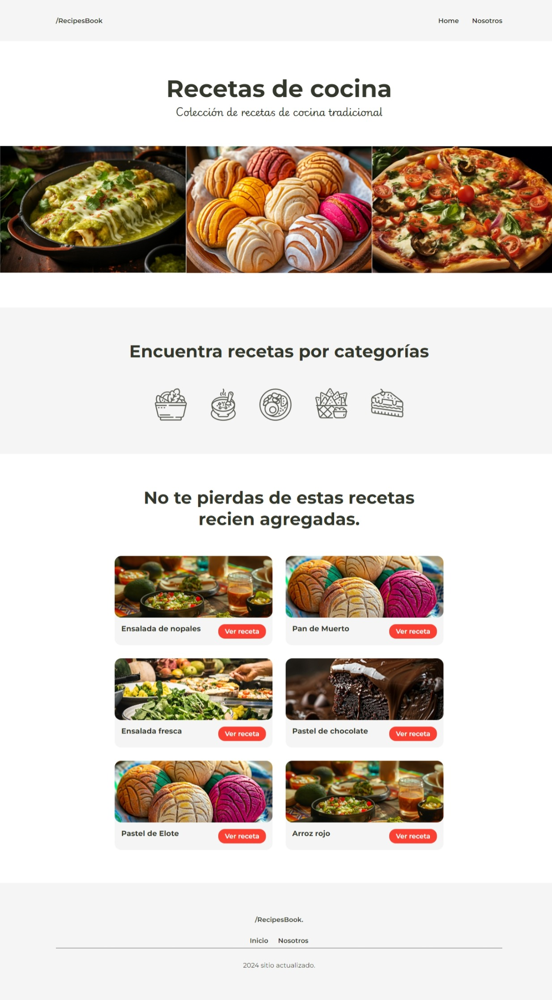

# Proyecto: Recetas en linea

### Descripción:

Proyecto de consumo de API REST para visualizar datos en pantalla y reforzar conocimientos de HTML, CSS, React y diseño web responsive.

**Vista previa del proyecto:**

### Recursos
* Fuente en [Google Fonts](https://fonts.google.com/)
* Imagenes en [Lummi](https://www.lummi.ai/)
* Iconos en [tabler ICONS](https://tabler.io/icons)
* Colores en [color hunt](https://colorhunt.co/)
